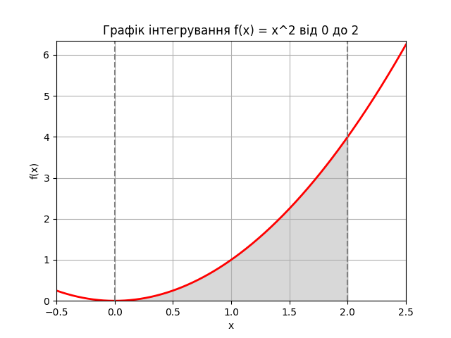

# Linear programming and randomized algorithms

### Task 1. Optimization of production

The company produces two types of drinks: "Lemonade" and "Fruit juice". Different ingredients and a limited amount of equipment are used to produce these drinks. The challenge is to maximize production given limited resources.

**Task conditions:**

1. "Lemonade" is made from "Water", "Sugar" and "Lemon juice".
2. "Fruit juice" is made from "Fruit puree" and "Water".
3. Resource limit: 100 units. "Waters", 50 units. "Sugar", 30 units. "Lemon juice" and 40 units. "Fruit puree".
4. Production of a unit of "Lemonade" requires 2 units. "Waters", 1 unit "Sugar" and 1 unit "Lemon juice".
5. The production of a unit of "Fruit juice" requires 2 units. "Fruit puree" and 1 unit "Waters".

Using PuLP, create a model that determines how much "Lemonade" and "Fruit Juice" should be produced to maximize the total amount of products, subject to resource constraints. Write a program whose code maximizes the total number of products "Lemonade" and "Fruit Juice" produced, given the constraints on the number of resources.

### Task 2. Calculation of the definite integral.

Your second task is to calculate the value of the integral of the function using the Monte Carlo method.

1. Calculate the value of the integral of the function using the Monte Carlo method, in other words, find the area under this graph (gray area).

2. Check the correctness of the calculations to confirm the accuracy of the Monte Carlo method by comparing the obtained result with analytical calculations or the result of running the quad function. Draw conclusions.

### Розв'язання:

## Завдання 1

### Результати

 - Кількість лимонаду: 30.0
 - Кількість фруктового соку: 20.0
 - Загальна кількість продуктів: 50.0

### Висновки

1. **Кількість лимонаду:** 30.0 одиниць — це максимальна кількість лимонаду, яку можна виробити з доступними ресурсами.

2. **Кількість фруктового соку:** 20.0 одиниць — це максимальна кількість фруктового соку, яку можна виробити з доступними ресурсами.

3. **Загальна кількість продуктів:** 50.0 — це максимальна кількість продукції (лимонаду і фруктового соку) разом, яку можна виробити при даних обмеженнях.

## Завдання 2

### Результати

- Числовий інтеграл: (2.666666666666667, 2.960594732333751e-14)
- Monte Carlo інтеграл (100 точок): 3.2
- Monte Carlo інтеграл (1000 точок): 2.72
- Monte Carlo інтеграл (10000 точок): 2.6608
- Monte Carlo інтеграл (100000 точок): 2.66824
- Monte Carlo інтеграл (1000000 точок): 2.65972

### Висновки

1. Як видно з результатів, оцінка інтеграла методом Монте-Карло наближається до точного значення зі збільшенням кількості точок. Це очікуваний результат, оскільки точність методу Монте-Карло зростає при збільшенні числа випадкових точок.

2. Для малого числа точок (100 та 1000) результати значно відрізняються від точного значення. Однак, при збільшенні числа точок до 10000 і більше, результати стають ближчими до точного значення.

3. Найбільш точні результати отримані для 100000 і 1000000 точок, де оцінка інтеграла дуже близька до точного значення 2.666666666666667.

4. Метод Монте-Карло є ефективним інструментом для наближеного обчислення інтегралів, особливо коли аналітичне обчислення є складним або неможливим. Однак, функція quad з бібліотеки SciPy забезпечує більш точний результат з оцінкою абсолютної помилки.